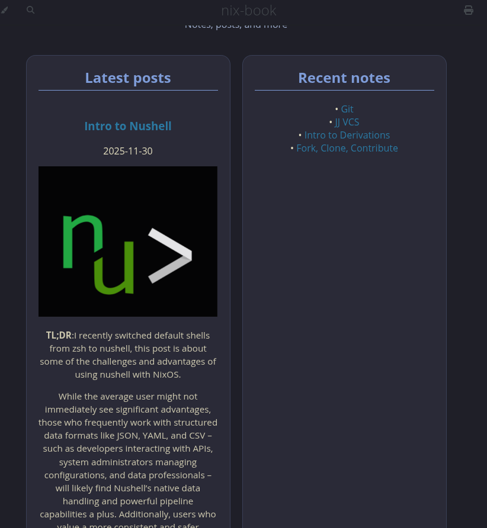
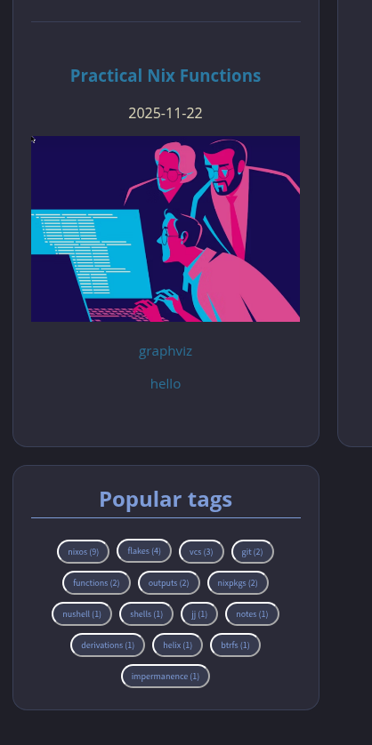
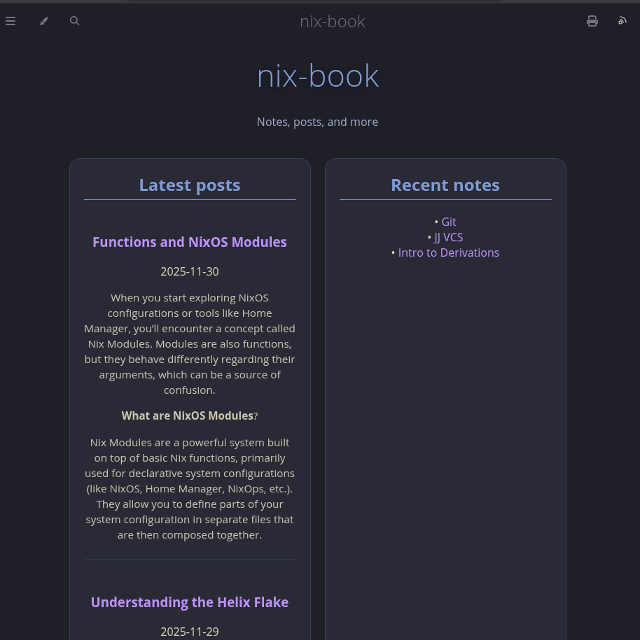

# mdbook-kanagawa-theme

`mdbook-kanagawa-theme` provides a Kanagawa-inspired **landing page** and **full
visual theme override** for the HTML renderer.  
It does not replace mdBook’s HTML backend, but it does replace the default
`theme/css/chrome.css` with a Kanagawa-flavored version.

The theme dropdown still works but the themes have a slightly different look.

The landing page replaces `index.md` with a side‑by‑side layout for big screens,
and top-over-bottom for small screens:



The landing page replaces `index.md` with a side‑by‑side layout (or not for
small screens):

- **Latest Posts**
- **Recent Notes**
- **Popular Tags**

The content comes from:

- [`mdbook-content-collections`](https://crates.io/crates/mdbook-content-collections)
- [`mdbook-content-loader`](https://crates.io/crates/mdbook-content-loader)

Together they generate `content-collections.json` and expose a
`window.CONTENT_COLLECTIONS` global that this theme uses to render the cards.

<details>
<summary> Click to Expand Popular tags Example </summary>

> You can click on the tag to bring up the associated chapters.



</details>

---

## Installation

```bash
cargo install mdbook-kanagawa-theme
# Install the themes dependencies
cargo install mdbook-content-collections
cargo install mdbook-content-loader
# You'll probably want to strip the frontmatter
# cargo install mdbook-frontmatter-strip
```

Version check:

```bash
mdbook-kanagawa-theme --version
mdbook-kanagawa-theme -V
```

Add the preprocessor to your `book.toml`. (I've included the other dependencies
for clarity, you'll still want to set your `site-url` and whatever else your
site requires):

```toml
[book]
title = "My Kanagawa Book"
authors = ["Your Name"]
description = "Docs with a configurable Kanagawa-inspired landing page"

[build]
# Optional, just to keep builds tidy
build-dir = "book"

[preprocessor.content-collections]
renderers = ["html"]

[preprocessor.content-loader]
command = "mdbook-content-loader"
renderers = ["html"]
after = ["content-collections"]
# inject_all = true

[preprocessor.kanagawa-theme]
renderers = ["html"]
before = ["content-loader", "content-collections"]
# Landing page text
landing_title    = "My Docs"
landing_subtitle = "Notes, posts, and more"

# Column headers
header_latest = "Latest posts"
header_notes  = "Recent notes"
header_tags   = "Popular tags"

# Optional: prepend an @import to the generated theme/css/chrome.css
# Path is relative to the built book root (same as other mdBook theme files).
# css_import = "/assets/dracula.css"


# Optional: if true, the preprocessor will NOT write theme/css/chrome.css
# (use this if you want to maintain your own chrome.css instead)
# disable_builtin_css = true

[output.html]
# Do NOT use additional-css for the main theme override.
# default-theme still controls which theme class is set (rust, coal, navy, …)
default-theme = "navy"
preferred-dark-theme = "navy"
```

On each build, the preprocessor:

1. Overwrites `index.md` with the Kanagawa landing page HTML.

2. Writes `theme/css/chrome.css`, built from a template copy of mdBook’s own
   `chrome.css` plus Kanagawa variables and extra styles.

You do **not** need `additional-css = ["theme/kanagawa.css"]`; the theme is
injected by replacing `theme/css/chrome.css` directly. This was required for the
theme to be respected in the latest mdbook versions.

---

## Usage

**Latest posts**

This theme works by filtering and sorting your frontmatter. For example, to add
links/overviews/pics to the "Latest posts" card, your frontmatter would look
like this:

```yaml
---
title: Nix Pull Requests
date: 2025-11-27
author: saylesss88
collection: "blog"
tags: ["nixos", "nixpkgs"]
draft: false
---
```

Now the chapter with the above frontmatter will be added to the "Latest posts"
card.

If you place an image above the first header, it will be shown in this card
along with the date and overview. I may add the author to each chapter shown in
"Latest posts" in the future but currently the author isn't listed.

---

**Recent notes**

The "Recent notes" card is tied to the `notes` collection:

```yaml
---
title: Intro to Derivations
date: 2025-11-21
author: saylesss88
collection: "notes"
tags: ["notes", "derivations"]
---
```

Now this chapter will be added to the "Recent notes" card. This card only lists
the links rather than the complete overview like "Latest posts" does. The
frontmatter is fairly forgiving but in this case, `"notes"` must be quoted.

---

**Popular tags**

Popular tags is automatically populated from the `tags` key in the frontmatter.

You can click the tag to bring up the overviews of the chapters associated with
the said tag.

---

## Overriding the palette (Dracula, etc.)

This is still a WIP, currently the overrides only apply to certain elements.
Dracula is just an example, the idea is to allow overriding to whatever you
prefer, just change the values in the provided `dracula.css` to what you like.



<details>
<summary> ✔️ Click to Expand override Example </summary>

You can still override the color palette while keeping the Kanagawa layout.

Create `your-book/src/assets/dracula.css`:

```css
/* src/assets/dracula.css */

html.navy,
body.navy,
.navy {
  /* Core page colors */
  --bg: #282a36;
  --bg-alt: #44475a;
  --fg: #f8f8f2;
  --fg-light: #cfcfd9;

  /* Waves / accent palette */
  --wave-1: #282a36;
  --wave-2: #343746;
  --wave-3: #44475a;

  --accent: #bd93f9;
  --red: #ff5555;
  --blue: #8be9fd;

  /* mdBook-specific navy vars */
  --sidebar-bg: #282a36;
  --sidebar-fg: #f8f8f2;
  --sidebar-non-existant: #6272a4;
  --sidebar-active: #bd93f9;
  --sidebar-spacer: #44475a;

  --links: #bd93f9;

  --quote-bg: #343746;
  --quote-border: #44475a;

  --table-header-bg: #44475a;
  --table-alternate-bg: #343746;

  /* tweak others as you like */
}
```

When you run `mdbook build` this file will be placed in
`your-book/book/assets/dracula.css`.

And in `book.toml`:

```toml
[preprocessor.kanagawa-theme]
renderers = ["html"]
before = ["content-loader", "content-collections"]

landing_title = "My mdBook"
landing_subtitle = "Notes, posts, and more"

header_latest = "Latest posts"
header_notes = "Recent notes"
header_tags = "Popular tags"

css_import = "/assets/dracula.css"
disable_builtin_css = false
```

With this setup:

- mdBook still builds the book as usual, and `mdbook-kanagawa-theme` generates
  `theme/css/chrome.css` with the Kanagawa layout and variable hooks.​

- The preprocessor adds an `@import "/assets/dracula.css";` (from `css_import`)
  at the top of that generated `chrome.css`, so your Dracula file runs after the
  built‑in variable defaults.​

- Because `dracula.css` redefines the same CSS custom properties used by the
  Kanagawa theme (`--bg`, `--fg`, `--accent`, sidebar colors, etc.), the page
  keeps the Kanagawa layout and landing page, but all colors for the `navy`
  theme class come from your Dracula palette instead. Kanagawa provides the
  layout and default palette.

- The theme is only overridden currently for `Auto`, and `Navy` from the
  dropdown.

</details>

---

## Preprocessor pipeline

This theme is intended to sit in a small pipeline with the content
preprocessors:

```toml
[preprocessor.content-collections]
renderers = ["html"]

[preprocessor.content-loader]
renderers = ["html"]
after = ["content-collections"]

[preprocessor.kanagawa-theme]
renderers = ["html"]
before = ["content-loader", "content-collections"]

[output.html]
default-theme = "navy"
preferred-dark-theme = "navy"
```

Order matters:

1. `mdbook-content-collections` builds `content-collections.json`.

2. `mdbook-content-loader` injects `window.CONTENT_COLLECTIONS`.

3. `mdbook-kanagawa-theme` overwrites `index.md` content with your landing page
   and writes `theme/css/chrome.css`.

The theme expects a blank `index.md` for the landing page, you can create one by
adding the following to your `SUMMARY.md` as the first line:

```md
[](index.md)
```

Run `mdbook build`, and the theme is automatically injected and applied.

---

## Light/Dark and default-theme behavior

Because this crate replaces `theme/css/chrome.css`, it effectively owns the
visual theme for all built‑in modes (`light`, `rust`, `coal`, `navy`). The
mdBook theme dropdown and your `default-theme` / `preferred-dark-theme` still
control which class is applied to the page, but the palette for each of those
classes is defined by the Kanagawa (or Dracula‑overridden) variables.

---

## Stripping the frontmatter

mdBook does not parse or strip YAML frontmatter, so the raw block (e.g. any YAML
keys like `title:`, `date:`, etc.) appears in the HTML.

To avoid this, you can use:

- [mdbook-frontmatter-strip](https://crates.io/crates/mdbook-frontmatter-strip)

### License

[Apache License 2.0](https://github.com/saylesss88/mdbook-kanagawa-theme/blob/main/LICENSE)
